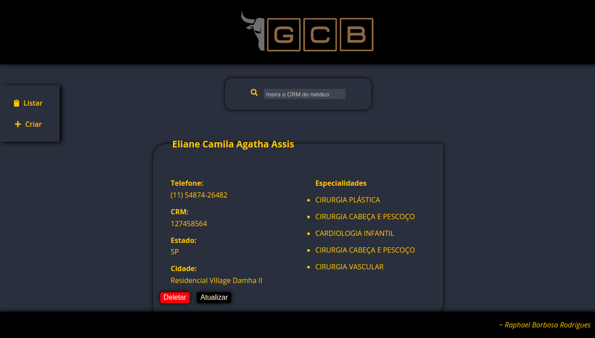
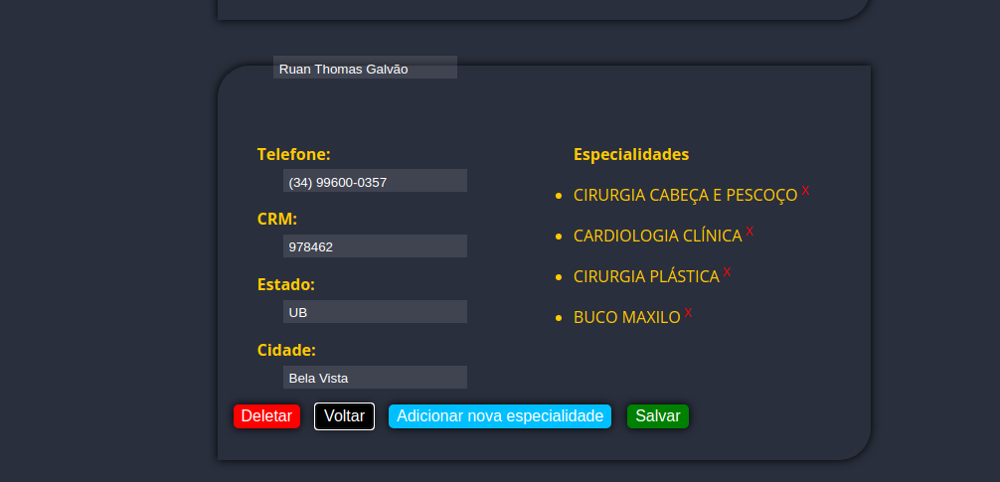
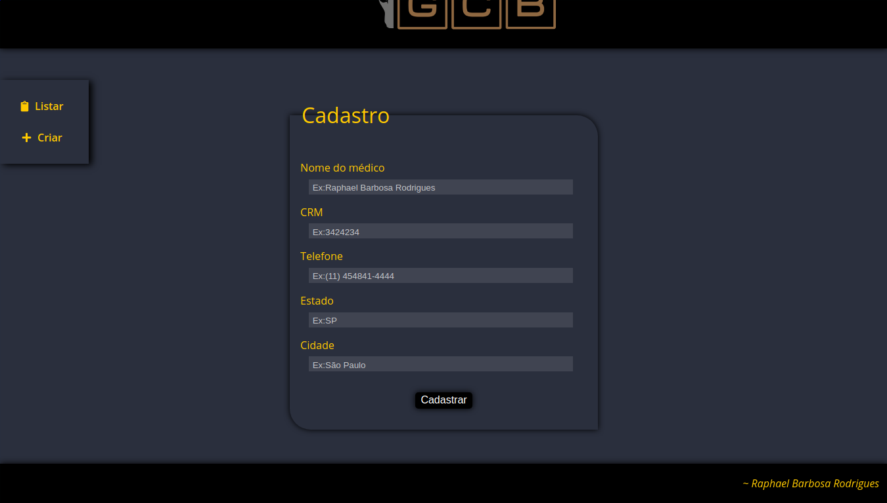

# Teste remoto para a vaga de Back-End Jr. (GCB)

## Links úteis

### Repositório
* https://github.com/RaphaelBRodrigues/GCB-Remoto.git

### Projeto (React)
* Principal - https://raphaelbrodrigues.github.io/GCB-Remoto/
* Backup - http://raphaelgcbbkp-dev.umbler.net/build

### API (Node.Js)
* `Endpoint Principal` -  http://raphaelgcb-dev.umbler.net/
* `Endpoint Backup` -  http://raphaelgcbbkp-dev.umbler.net/

* `GET - /` - Exibe todos os endpoints disponíveis

## Principais tecnologias utilizadas

### Back-end
* Node.Js
* Express
* Knex
* MySQL

### Front-end
* React
* Axios

#### Layout

